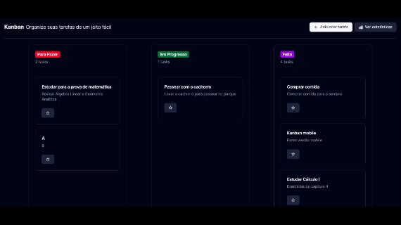
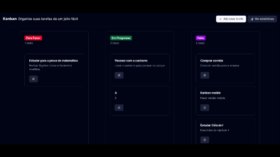
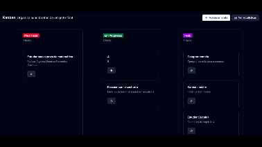

# Kanban de Tarefas

## Como rodar

1. Rode `npm install` para instalar as dependências;
2. Rode `npm run seed` para inserir tarefas pré-definidas no banco de dados;
3. Rode `npm run dev` para roda o projeto;
4. Acesse [http://localhost:3000](http://localhost:3000) para ver o resultado.

## Funcionalidades

### Criar tarefa

### Trocar status

### Favoritar tarefa

### Ver estatísticas
